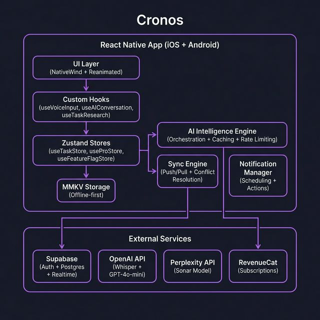
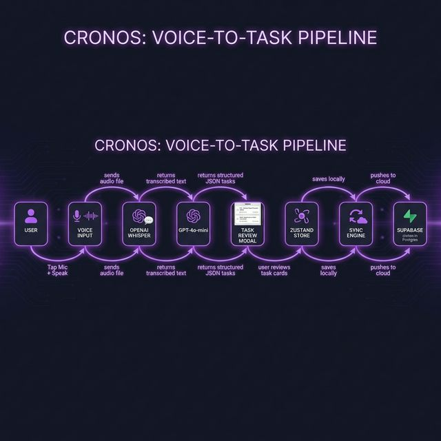
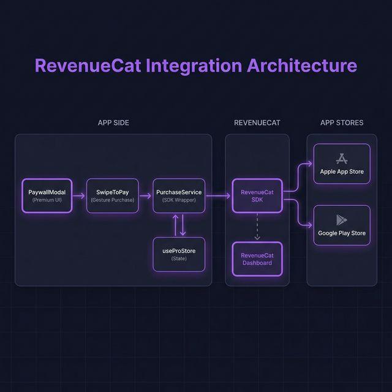

# Cronos — Technical Documentation

## Tech Stack Overview

| Layer | Technology | Purpose |
|---|---|---|
| **Framework** | React Native 0.81 + Expo SDK 54 | Cross-platform iOS & Android from a single TypeScript codebase. New Architecture enabled. |
| **Routing** | Expo Router v6 | File-based routing with typed routes and auth-guarded navigation |
| **State** | Zustand + MMKV | Offline-first state persistence (30x faster than AsyncStorage) with schema migrations |
| **Backend** | Supabase (PostgreSQL + Auth + Realtime) | User authentication, cloud database, and real-time WebSocket subscriptions for cross-device sync |
| **AI — Voice** | OpenAI Whisper + GPT-4o-mini | Speech-to-text transcription and natural language → structured task parsing |
| **AI — Intelligence** | Perplexity Sonar API | Task research, conversational chat, sub-task generation with real-time web data and citations |
| **Notifications** | Expo Notifications | Scheduled reminders with actionable categories (snooze 5/10/30 min, mark complete) |
| **Monetization** | RevenueCat (react-native-purchases) | Subscription management, entitlement checking, purchase restoration across platforms |
| **UI** | NativeWind + Reanimated + Expo Haptics | Responsive styling, gesture-driven animations, haptic feedback, dark mode |
| **Language** | TypeScript | End-to-end type safety across all layers |

---

## Architecture

### High-Level Architecture



The app is structured in clear layers:

- **UI Layer** — React Native components styled with NativeWind (TailwindCSS) and animated with Reanimated
- **Custom Hooks** — Encapsulate business logic for voice input, AI conversations, task research, and sub-task suggestions
- **Zustand Stores** — Three persisted stores (`useTaskStore`, `useProStore`, `useFeatureFlagStore`) backed by MMKV for offline-first operation
- **AI Intelligence Engine** — Central orchestration layer that routes all AI requests through Perplexity and OpenAI with caching, rate limiting, and error recovery
- **Sync Engine** — Bidirectional sync with Supabase using push/pull with timestamp-based conflict resolution and Realtime subscriptions
- **Notification Manager** — Schedules, cancels, and reschedules notifications with actionable buttons (snooze/complete)

### Voice-to-Task Pipeline



The complete voice pipeline:

1. **User taps mic** — Expo AV starts recording with platform-adaptive encoding (CAF on iOS, M4A on Android)
2. **Audio sent to Whisper** — OpenAI Whisper API transcribes the audio with retry logic
3. **Text parsed by GPT-4o-mini** — Custom prompt extracts title, due date, priority, repeat config, and description. Supports multiple tasks in one utterance
4. **Review modal** — Swipeable card UI lets users edit any field before confirming
5. **Saved to store** — Tasks persisted locally via Zustand + MMKV
6. **Synced to cloud** — Sync engine pushes to Supabase, Realtime propagates to other devices

---

## Module Breakdown

### 1. AI Intelligence Engine (`services/AIIntelligenceEngine.ts`)

Central orchestration layer wrapping all AI calls with:

- **Caching** — MMKV-backed response cache with 7-day TTL and 100-entry limit
- **Rate Limiting** — 10 requests/minute, 100 requests/day with auto-reset
- **Feature Flags** — Master switch + per-feature toggles via `useFeatureFlagStore`
- **Error Handling** — Custom `AIServiceError` with codes and retry hints

| Capability | API | Output |
|---|---|---|
| Task Analysis | Perplexity Sonar | Task type, difficulty, time estimate |
| Deep Research | Perplexity Sonar | Key points, checklist, tips, cited resources |
| Conversational Chat | Perplexity Sonar | Multi-turn responses with citations |
| Sub-Task Generation | Perplexity Sonar | Actionable sub-tasks with priorities |

### 2. Sync Engine (`services/SyncService.ts`)

- **Push** — Scans for `isSynced === false` tasks, upserts to Supabase
- **Pull** — Fetches all remote tasks, compares by `updated_at` timestamp. Newer remote wins. Detects remote deletions
- **Realtime** — Supabase Realtime channel subscription, debounced at 300ms
- **Loop Prevention** — Push-timestamp tracking (1s cooldown), 30s sync timeout circuit breaker
- **Notification Sync** — Reschedules notifications on pulled tasks across devices

### 3. State Management

| Store | Purpose | Key State |
|---|---|---|
| `useTaskStore` | Task CRUD + sync state | `tasks[]`, `isSyncing`, `lastSyncAt` |
| `useProStore` | Subscription status | `isPro`, `isLoading`, `lastChecked` |
| `useFeatureFlagStore` | AI feature toggles | Feature flags, API keys, rate limits |

All stores persisted to MMKV with migration support (current: version 5).

### 4. Notification System (`core/notifications/NotificationManager.ts`)

- **Scheduling** — Notifications at exact `dueDate` + pre-notifications via `preNotifyOffsets`
- **Actionable** — Category `REMINDER_ACTION`: Snooze 5m, 10m, 30m, Mark Done
- **Repeat Tasks** — On completion, `RepeatCalculator` computes next occurrence and reschedules
- **Cross-device** — Notifications rescheduled on sync pull for consistency

---

## RevenueCat Implementation

### Architecture



### SDK Initialization (`services/PurchaseService.ts`)

RevenueCat is initialized on app launch via `initializePurchases()`:

- Platform-specific API keys (`REVENUECAT_API_KEY_IOS` / `REVENUECAT_API_KEY_ANDROID`) from environment variables
- User ID linked via `Purchases.logIn(userId)` for cross-device entitlement tracking
- Debug logging in `__DEV__` mode
- Graceful degradation — missing or invalid keys don't crash the app

### Entitlement Model

Single entitlement: **`pro`**

- Checked via `Purchases.getCustomerInfo()` → `customerInfo.entitlements.active['pro']`
- `useProStore` caches the result locally and exposes `isPro` app-wide
- Checked on app launch and after every purchase/restore event

### Offerings & Packages

- Fetched dynamically from RevenueCat dashboard via `getOfferings()`
- Annual package (`$rc_annual`) pre-selected as "Best Value"
- `SubscriptionCard` component displays price and billing period from RevenueCat — not hardcoded

### Purchase Flow

```
User selects plan → SwipeToPay gesture (85% threshold) → purchasePackage()
→ Native Apple/Google payment sheet → RevenueCat validates → Check entitlement
→ Update useProStore → Confetti animation 🎉
```

**SwipeToPay** (`components/SwipeToPay.tsx`)
- Custom gesture using React Native Gesture Handler + Reanimated
- 85% swipe threshold to confirm purchase
- Animated text fade, spring physics, haptic feedback
- Loading and disabled states

**PaywallModal** (`components/PaywallModal.tsx`)
- Full-screen modal with premium gradient background
- Feature showcase: AI Voice Input, Cloud Sync, Unlimited Tasks, AI Assistant
- Plan selection cards, SwipeToPay slider, restore button
- Confetti cannon on successful purchase

### Purchase Restoration

`restorePurchases()` recovers entitlements for reinstalls, device switches, or data clears. Updates `useProStore` and shows confetti on success.

### User Lifecycle

| Event | Action |
|---|---|
| App launch | `initializePurchases(userId)` → `checkProStatus()` |
| Paywall opened | `getOfferings()` → display plans |
| Purchase completed | `purchasePackage()` → `checkProStatus()` → update store |
| Restore tapped | `restorePurchases()` → update store |
| User signs out | `logoutUser()` → `useProStore.reset()` |

### Feature Gating

Premium features gated via `useProStore.isPro`:

```typescript
const { isPro } = useProStore();
if (!isPro) {
    setShowPaywall(true); // Show PaywallModal
    return;
}
// Proceed with premium feature (voice input, AI, etc.)
```

The `PremiumMicButton` wraps voice input with a visual Pro indicator and routes non-subscribers to the paywall.
